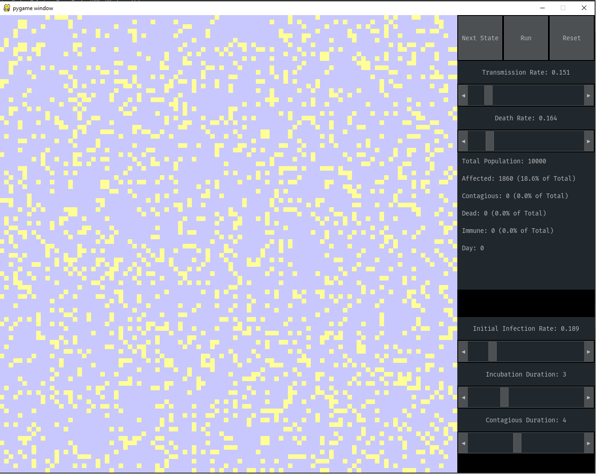
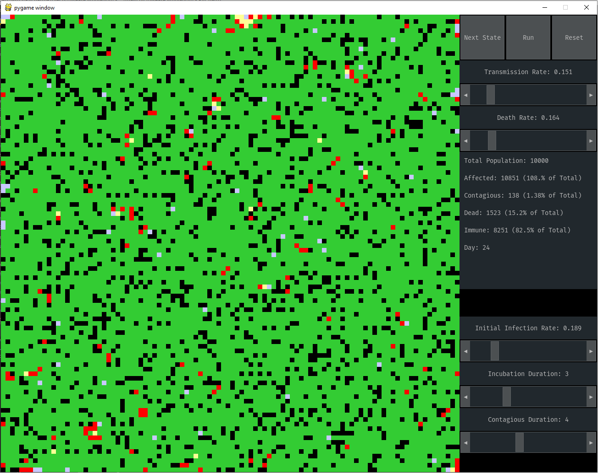

# Disease Simulation
 
A Game of Life based simulation of how a disease progresses through a population.
## Table of Contents
* [General info](#general-info)
* [Features](#features)
* [Setup](#setup)
* [Screenshots](#screenshots)
### General info
This simulation began as an optional assignment in one of my data science classes and due to it being fun to work on, it quickly
evolved into something bigger. Although the program is formally a disease simulation, the general approach of simulating the spread
of something on a 2D grid is generalizable to many other phenomena, such as wildfires.
Colors mean the following: Teal is healthy, yellow is infected+not contagious, red is infected+contagious, black is dead, green is recovered (immune)
- Language: Python
- Libraries: pygame for rendering, pygame_gui for UI elements
### Features
- All simulation parameters are tunable from the GUI and all the state information is displayed on the screen.
- The run of a simulation is animated using pygame.
- Algorithimic optimization for increased performance.
### Setup
Clone the repository, install pygame and pygame_gui if you have to and then run main.
### Screenshots

